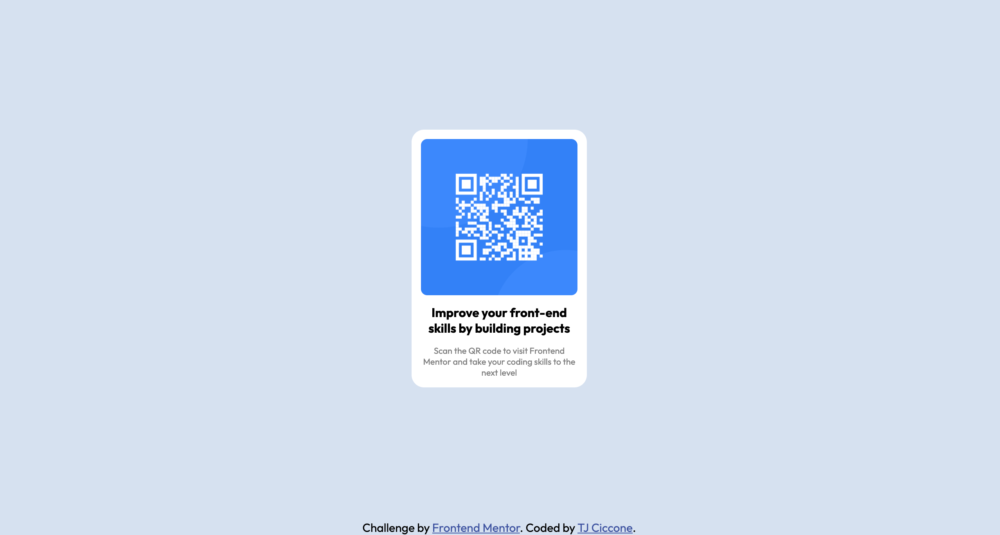

# Frontend Mentor - QR code component solution

This is a solution to the [QR code component challenge on Frontend Mentor](https://www.frontendmentor.io/challenges/qr-code-component-iux_sIO_H). Frontend Mentor challenges help you improve your coding skills by building realistic projects. 

## Table of contents

- [Overview](#overview)
  - [Screenshot](#screenshot)
  - [Links](#links)
- [My process](#my-process)
  - [Built with](#built-with)
  - [What I learned](#what-i-learned)
  - [Continued development](#continued-development)
  - [Useful resources](#useful-resources)
- [Author](#author)
- [Acknowledgments](#acknowledgments)

## Overview

### Screenshot

### Links

- Solution URL: [https://www.frontendmentor.io/solutions/qr-code-component-using-flexbox-e1ZKTIxMs]
- Live Site URL: [https://teej0103.github.io/qr-code-component/]

## My process

### Built with

- Semantic HTML5 markup
- CSS custom properties
- Flexbox
- Mobile-first workflow

### What I learned

Used this project to practice CSS properties and Flexbox

### Continued development

Will continue to develope CSS and Flexbox proficiency, as well as learn CSS grid to perfect layouts

## Author

- Frontend Mentor - [teej0103](https://www.frontendmentor.io/profile/teej0103)
- Twitter - [ciccone_tj](https://www.twitter.com/ciccone_tj)

## Acknowledgments
